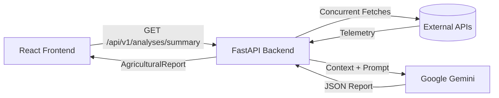

# AgroSphere

AgroSphere is an AI-powered agricultural intelligence dashboard. It provides detailed, coordinate-specific analyses of land viability, soil health, climate, and crop suitability across Ethiopia. By aggregating multiple streams of live satellite and environmental telemetry into a Google Gemini-powered analysis engine, AgroSphere helps determine if a given coordinate is farmable and recommends actionable agricultural strategies.

## Key Features

- **Interactive Geospatial Mapping:** A 6-tier dynamic zoom map built with React-Leaflet, featuring automatic decluttering (hiding cities at high zoom for clear satellite inspection) and cinematic "fly-to" coordinate routing.
- **AI-Generated Insights:** Uses Google Gemini 3.1 Flash to generate strict, highly-structured agricultural reports based on raw satellite data.
- **Anti-Hallucination Guardrails:** Implements a two-tiered location summary (General Region vs. Exact Satellite Terrain) ensuring the AI prioritizes actual `crop_cover_2019` telemetry over geographic naming stereotypes.
- **Live Environmental Telemetry:** Concurrently fetches data from OpenStreetMap (Reverse Geocoding), ISDA-Africa (High-Resolution Soil properties), Open-Meteo (Climate), and OpenTopoData (Elevation).
- **Geographic Fencing:** Enforces a strict geofence for Ethiopia, instantly rejecting out-of-bounds coordinates to save AI compute time.

---

## Architecture

AgroSphere is structured as a monorepo containing a distinct Frontend and Backend.

1. **User Interaction:** The user clicks the React map or enters coordinates manually.
2. **Data Fetching:** The React frontend makes a `GET` request to the FastAPI backend.
3. **Telemetry Aggregation:** The backend concurrently fetches soil, weather, elevation, and geocoding data from external APIs.
4. **AI Processing:** If the coordinate is farmable, the backend feeds the telemetry to Google Gemini with a highly specific system prompt.
5. **Display:** The generated JSON report is returned to the frontend and rendered in a dark "Glassmorphic" Intelligence Panel.



---

## Technology Stack

### Frontend
- **Framework:** React 19, Vite, TypeScript
- **Mapping:** Leaflet, React-Leaflet
- **Styling:** Vanilla CSS Modules (Deep Space Glassmorphism theme)
- **Icons:** Lucide-React

### Backend
- **Framework:** Python 3.10+, FastAPI, Uvicorn
- **AI Integration:** `google-generativeai` (Gemini 3.1 Flash)
- **Database / ORM:** SQLAlchemy, Asyncpg, PostgreSQL (Configured for caching)
- **HTTP Client:** `httpx`

### External APIs
- **ISDA-Africa API:** High-resolution soil properties (pH, organic carbon, crop cover).
- **Open-Meteo:** Current weather and climate summaries.
- **OpenTopoData:** SRTM90m elevation data.
- **OpenStreetMap (Nominatim):** Reverse geocoding for geographic fencing and district mapping.

---

## Repository Structure

```text
AgroSphere/
├── backend/
│   ├── app/
│   │   ├── api/v1/        # API Routers (analyses.py, location.py)
│   │   ├── clients/       # HTTP wrappers for external telemetry APIs
│   │   ├── core/          # Configuration and environment variables
│   │   ├── db/            # SQLAlchemy session management
│   │   ├── schemas/       # Pydantic validation models (AgriculturalReport)
│   │   └── services/      # LLM Prompt engineering and business logic (llm.py)
│   ├── main.py            # FastAPI application entry point
│   └── requirements.txt
├── frontend/
│   ├── src/
│   │   ├── components/
│   │   │   ├── Dashboard/ # IntelligencePanel component and glassmorphism styling
│   │   │   └── Map/       # MapExplorer, Leaflet setup, and GeoJSON overlays
│   │   ├── mockData/      # Fallback mock responses
│   │   ├── App.tsx        # Application root and state management
│   │   └── types.ts       # TypeScript interfaces
│   ├── package.json
│   └── vite.config.ts
├── .env                   # Environment variables (Ignored in Git)
└── README.md
```

---

## API Documentation

The FastAPI backend automatically generates Swagger documentation. Once running, visit:
`http://localhost:8000/docs`

### Primary Endpoint
**`GET /api/v1/analyses/summary`**

* **Purpose:** Generates a comprehensive agricultural report for a given coordinate.
* **Query Parameters:** 
  * `lat` (float): Latitude
  * `lon` (float): Longitude
* **Returns:** A JSON object matching the `AgriculturalReport` Pydantic schema (Farmable status, summaries, recommended crops, soil amendments, and risk factors).

---

## Environment Variables

To run AgroSphere locally, you must create a `.env` file in the root `AgroSphere/` directory. 

> [!WARNING]  
> **Security Note:** Never commit your `.env` file to version control. Backend secrets (like API keys and Database credentials) should only ever be accessible to the FastAPI server and should never be exposed in the frontend code.

**Example `.env` configuration:**
```env
# Backend Settings
PROJECT_NAME="AgroSphere API"
FRONTEND_URL="http://localhost:5173" # The URL of your React frontend (used for CORS)

# Database Configuration (For Caching)
DB_USER="postgres"
DB_PASSWORD="your_db_password"
DB_HOST="localhost"
DB_PORT="5432"
DB_NAME="soil_info_db"

# External API Credentials
ISDA_EMAIL="your_isda_account_email"
ISDA_PASSWORD="your_isda_password"
GOOGLE_API_KEY="your_gemini_api_key"
OPENCAGE_API_KEY="your_opencage_key"
```

---

## Local Development Setup

### 1. Start the Backend
1. Open a terminal in the `backend/` directory.
2. Create and activate a Python virtual environment:
   ```bash
   python -m venv .venv
   source .venv/bin/activate  # On Windows: .venv\Scripts\activate
   ```
3. Install dependencies:
   ```bash
   pip install -r requirements.txt
   ```
4. Start the FastAPI server (it will automatically load your `.env` file):
   ```bash
   uvicorn app.main:app --reload
   ```

### 2. Start the Frontend
1. Open a new terminal in the `frontend/` directory.
2. Install npm dependencies:
   ```bash
   npm install
   ```
3. Create a `.env` file inside the `frontend/` directory to link the React app to the backend:
   ```env
   VITE_API_URL="http://localhost:8000"
   ```
4. Start the Vite development server:
   ```bash
   npm run dev
   ```
5. Open `http://localhost:5173` in your browser.

---

## Production Deployment

AgroSphere is designed for a **Split Deployment** architecture. 

### Frontend (Vercel)
1. Import the repository into Vercel.
2. Set the Root Directory to `frontend/`.
3. Add the `VITE_API_URL` environment variable pointing to your live backend URL (e.g., `https://agrosphere-api.onrender.com`).
4. Deploy.

### Backend (Render or Railway)
1. Import the repository into your platform.
2. Set the Root Directory to `backend/`.
3. Add all your backend secrets (Google API Key, ISDA credentials, Database URL) to the platform's Environment Variables panel.
4. Crucially, set `FRONTEND_URL` to your live Vercel URL (e.g., `https://agrosphere.vercel.app`) so the FastAPI CORS middleware accepts requests from your live app.

---

## Limitations / Current Scope
- **Geographic Lock:** The current implementation is strictly fenced to **Ethiopia**. Coordinates outside of Ethiopia will bypass AI generation and instantly return a predefined "Unfarmable" message to conserve API limits.
- **ISDA Accounts:** The ISDA-Africa Soil API enforces strict authentication. The backend `soil.py` client automatically requests short-lived JWT tokens using the credentials stored in your environment variables. 

## Future Improvements
- Implement historical weather tracking charts.
- PDF Export functionality for generated reports.
- User authentication and saved coordinate history via PostgreSQL.
